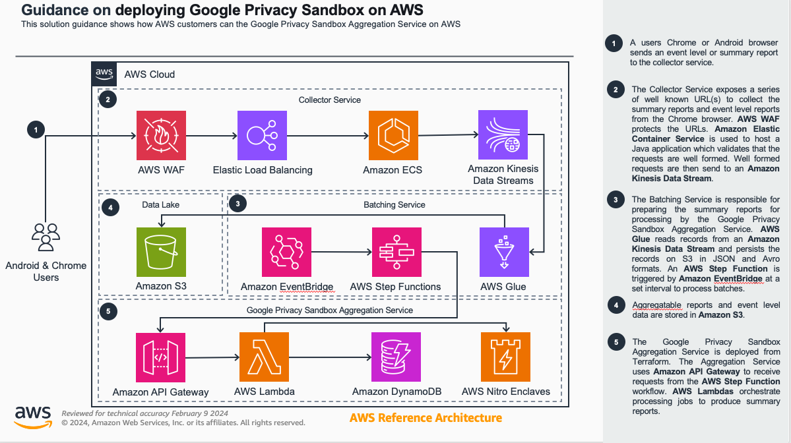

# Deploing Privacy Sandbox on AWS

## Table of Content

1. [Overview](#overview)
    - [Cost](#cost)
2. [Prerequisites](#prerequisites)
    - [Operating System](#operating-system)
3. [Deployment Steps](#deployment-steps)
4. [Deployment Validation](#deployment-validation)
5. [Running the Guidance](#running-the-guidance)
6. [Next Steps](#next-steps)
7. [Cleanup](#cleanup)
8. [FAQ, known issues, additional considerations, and limitations](#faq-known-issues-additional-considerations-and-limitations)
9. [Revisions](#revisions)
10. [Notices](#notices)
11. [Authors](#authors)

## Overview
This solution demonstrates how to deploy the Privacy Sandbox Private Aggregation Service and supporting services for Privacy Sandbox report collection and processing on AWS. The guidance currently does not implement batching functionality required to process reports, but will be updated in the future to support this.


### Architecture Overview


### Cost

_You are responsible for the cost of the AWS services used while running this Guidance. As of May 2024, the cost for running this Guidance with the default settings in the <Default AWS Region (Most likely will be US East (N. Virginia)) > is approximately $2,599 per month for processing ( 30 million records each day )._


## Prerequisites

Currently deploying the the [Privacy Sandbox Aggregation Service](https://github.com/privacysandbox/aggregation-service/tree/main) on AWS is optional, but recommmended. This step will not be optional after future releases implement batching functionality. Instructions to deploy the Aggregation Service can be found [here](https://github.com/privacysandbox/aggregation-service/blob/main/docs/aws-aggregation-service.md).

### Operating System

The project code uses the Python version of the AWS CDK ([Cloud Development Kit](https://aws.amazon.com/cdk/)). To execute the project code, please ensure that you have fulfilled the [AWS CDK Prerequisites for Python](https://docs.aws.amazon.com/cdk/latest/guide/work-with-cdk-python.html). Steps for a macOS machine is captured here.  Deployment in another OS may require additional steps.

1. Install homebrew
```
/bin/bash -c "$(curl -fsSL https://raw.githubusercontent.com/Homebrew/install/HEAD/install.sh)"
```
2. Install Python
```
brew install python
```
3. Install Git client
```
brew install git
```
4. Install AWS CLI
```
brew install awscli
```
5. Create CLI credentials using IAM in AWS console and Configure CLI profiles
```
aws configure --profile <profile name>
```

### Python Dependencies
Review [requirements.txt](./requirements.txt) for the python dependencies

### AWS CDK bootstrap

The project code requires that the AWS account is [bootstrapped](https://docs.aws.amazon.com/de_de/cdk/latest/guide/bootstrapping.html) in order to allow the deployment of the CDK stack. Bootstrap CDK on the CLI profile you created earlier
```
cdk bootstrap --profile <profile name>
```

## Deployment Steps

1. Clone this repository to your development desktop
```
git clone **TODO GITHUB URL**
```
2. Use [envsetup.sh](./envsetup.sh) to setup virtual environment and install python dependencies

3. If you are using Visual Studio Code, you may need to update the python interpreter for the project


4. Create a [cdk.context.json](cdk.context.json) file. A example [cdk.context.json.example](cdk.context.json.example) is available in the repo. Update the privacy_sandbox_aggregation_service_api, this is the API Gateway URI deployed by the Privacy Sandbox Aggregation Service in the prerequesites step. Populating this value is optional for the current release.
```
{
     "privacy_sandbox_aggregation_service_api": "(OPTIONAL) <REPLACE WITH API GATEWAY URI FOR YOUR AGGREGATION SERVICE>"
}

 ```

5. Deploy the [CollectorBuild]('./deployment/collector_build.py') stack.
```
    cdk deploy CollectorBuild --profile <profile name>
```

6. Navigate to AWS CodeBuild in the console and locate the project created by the previous step. Start the build. Once the build has completed successfully proceed to the next step.

7.  cdk deploy CollectorService --profile <profile name>

8. Navigate to Glue ETL Jobs in the AWS Console and run the following Glue Jobs: job-aggregate-raw, job-aggregate-avro


## Deployment Validation
* Open CloudFormation console and verify the status of the template with the name starting with stack.
* If deployment is successful, you should see CollectorBuild and CollectorService in the console.
* The following Glue Jobs are running successfully: job-aggregate-raw, job-aggregate-avro

## Running the Guidance
1. Navigate to Glue ETL Jobs in the AWS Console and run the following Glue Jobs: job-aggregate-raw, job-aggregate-avro

2. Execute the request tester script by running the following command on your CLI. The script will prompt you for a URL. Provide the URL to the application load balancer deployed by the CollectorService stack.

```
python3 ./tests/integration/endpoint_test.py
```

3. Validate that data is being persisted to S3 by navigating to Amazon Athena in the AWS Console and running the following query:

```
SELECT 
  json_extract(shared_info, '$.api') AS api,
  json_extract(shared_info, '$.attribution_destination') AS attribution_destination,
  json_extract(shared_info, '$.report_id') AS report_id,
  json_extract(shared_info, '$.reporting_origin') AS reporting_origin,
  json_extract(shared_info, '$.scheduled_report_time') AS scheduled_report_time,
  json_extract(shared_info, '$.source_registration_time') AS source_registration_time,
  json_extract(shared_info, '$.version') AS version,
  t.payload.payload,
  t.payload.key_id,
  t.payload.debug_cleartext_payload,
  aggregation_coordinator_origin,
  source_debug_key,
  trigger_context_id,
  ingest_month,
  ingest_day,
  ingest_hour
FROM aggregation_report_avro
CROSS JOIN UNNEST(aggregation_service_payloads) AS t (payload)
```

### Expected output
You should be able to see data in the S3 buckets created while deploying the CollectorService stack.

## Next Steps

The Collector Service stack is used for demonstration purposes. Modify this to meet your requirements.

## Cleanup

When you’re finished experimenting with this solution, clean up your resources by running the command:

```
cdk destroy --all --profile=<profile name>
```

These commands deletes resources deploying through the solution. S3 buckets containing CloudWatch log groups are retained after the stack is deleted.


## FAQ, known issues, additional considerations, and limitations
- This guidance does not currently implement batching functionality. Example batching functionality will be introduced in the future.

**Known issues**


**Additional considerations**
- For any feedback, questions, or suggestions, please use the issues tab under this repo.

## Revisions


## Notices

*Customers are responsible for making their own independent assessment of the information in this Guidance. This Guidance: (a) is for informational purposes only, (b) represents AWS current product offerings and practices, which are subject to change without notice, and (c) does not create any commitments or assurances from AWS and its affiliates, suppliers or licensors. AWS products or services are provided “as is” without warranties, representations, or conditions of any kind, whether express or implied. AWS responsibilities and liabilities to its customers are controlled by AWS agreements, and this Guidance is not part of, nor does it modify, any agreement between AWS and its customers.*

## Authors

Bryan Furlong & Brian Maguire
